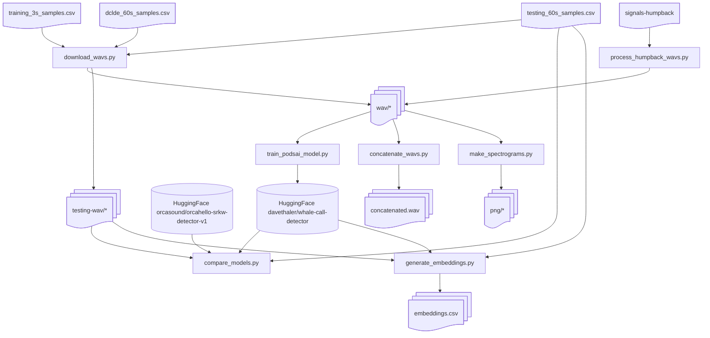

# Programmatic Orca Detection System using Artificial Intelligence (PODS-AI)

This repository contains scripts for training, evaluating, and using the
PODS-AI model for detecting orcas (both residents and Biggs/transients)
and humpbacks, based on [training data](docs/csv-manifests.md).

## Model Comparison

A comparison between the latest PODS-AI model and the current
[OrcaHello](https://github.com/orcasound/orcahello) model is:

```
================================================================================================================
Model Comparison Summary
================================================================================================================
Model           Evaluated   Correct  Accuracy      F1    RFP%    RFN%    TFP%    TFN%    HFP%    HFN%   Avg Time
----------------------------------------------------------------------------------------------------------------
orcahello             144        36     25.0%   0.119   93.5%   42.3%    0.0%  100.0%    0.0%  100.0%      4.89s
podsai                144        68     47.2%   0.507   16.3%   42.3%    4.4%   36.7%    0.0%   88.9%      7.52s
================================================================================================================

Definitions:
  Accuracy     = Correct / Evaluated
  Correct      = fastai/orcahello: resident vs other; oldpodsai/podsai: category in prediction set
  F1           = macro F1 over humpback, resident, and transient classes that are present
  [R|T|H]FP%   = among non-[R|T|H] samples, fraction predicted as that class
  [R|T|H]FN%   = among actual samples of that class, fraction predicted as another class
  Avg Time     = average time spent in model predict() per 60-second WAV file
  Note         = compares end-to-end 60-second inference on testing_60s_samples.csv

Confusion Matrix for orcahello (rows=actual, cols=predicted):
                other  resident     total
       bird         2         8        10
      human         0        10        10
   humpback         4        14        18
     jingle         0         7         7
   resident        22        30        52
  transient         0        30        30
     vessel         0         7         7
      water         0        10        10

Confusion Matrix for podsai (rows=actual, cols=predicted):
                 human   humpback   resident  transient     vessel      water      total
       bird          0          0          3          0          7          0         10
      human          9          0          0          1          0          0         10
   humpback          0          2          3          1         11          1         18
     jingle          0          0          0          0          7          0          7
   resident          1          0         30          3         16          2         52
  transient          0          0          9         19          2          0         30
     vessel          0          0          0          0          7          0          7
      water          0          0          0          0          9          1         10
```

## Overview of Scripts

The active scripts in `src` include:

- **download_wavs.py**: Uses `output/csv/training_3s_samples.csv`, `output/csv/testing_60s_samples.csv`, and `output/csv/dclde_60s_samples.csv` to download wav files. It keeps `output/wav/humpback/signals-humpback_*.wav` segments from the `signals-humpback` submodule (those rows are not in the CSVs).
- **make_spectrograms.py**: Creates a png file for each wav file in a subdirectory of `output/png`.
- **train_podsai_model.py**: Trains a PODS-AI model on the generated training samples, including retained humpback signal windows.
- [**compare_models.py**](docs/compare-models.md): Evaluates models using `output/csv/testing_60s_samples.csv`.
- [**generate_embeddings.py**](docs/generate-embeddings.md): Generates `output/csv/embeddings.csv` from `output/csv/testing_60s_samples.csv`.
- [**concatenate_wavs.py**](docs/concatenate-wavs.md): Concatenates WAV files in a directory into a single output file,
- **process_false_positives.py**: Re-checks rejected OrcaHello detections by
  downloading the 60-second WAV, re-running PODS-AI, and appending whale-class
  sub-segments with corrected classes to `output/csv/training_3s_samples.csv`.
  The corrected class is inferred from the human-authored portion of the moderation
  comments (auto-generated "AI: …" lines are ignored).  Explicit negations in the
  comments are understood: "No humpback" suppresses the humpback match, and
  "No humpback nor vessel" resolves the corrected class to `water`.
  Supports `--category CATEGORY` to process only detections whose inferred
  actual category matches the provided value.
- **process_false_negatives.py**: Re-checks confirmed OrcaHello detections by
  downloading the 60-second WAV, re-running PODS-AI and OrcaHello segment inference,
  and appending segments where OrcaHello predicts resident but PODS-AI does not to
  `output/csv/training_3s_samples.csv` with corrected class `resident`. Supports
  `--category CATEGORY` to process only detections whose PODS-AI predicted category
  matches the provided value.
  adding a short beep between clips to make quick listen-through review easier.
- **process_testing_set_mispredictions.py**: Scans `output/csv/testing_60s_samples.csv`,
  runs PODS-AI on each corresponding `output/testing-wav/<category>/...wav`, and
  proposes `training_3s_samples.csv` rows plus `testing_60s_samples.csv` rows to
  remove when non-adjacent high-confidence (>0.80) whale segments are found.
- [**run_inference.py**](docs/run-inference.md): Runs a model on a wav file and prints the global prediction,
  confidence, and per-class probabilities.
- [**generate_embeddings.py**](docs/generate-embeddings.md): Runs the PODS-AI AST model on a set of test WAV files and extracts the AST class token embeddings for each analyzed segment. Outputs a CSV containing embeddings, predictions, confidence scores, and metadata that can be used to generate UMAP visualizations of the model's learned audio representation.
- [**generate_umaps.py**](docs/generate-umaps.md): Creates a two-dimensional UMAP visualization from embeddings generated by `generate_embeddings.py`. Embeddings are projected using UMAP and colored by the selected label type (`ground_truth_label`, `predicted_label`, or `global_prediction_label`) to visualize how the PODS-AI AST model organizes different acoustic classes in embedding space. Outputs a publication-quality PNG figure.
- [**LiveInferenceOrchestrator.py**](docs/LiveInferenceOrchestrator.md): Runs live/date-range HLS inference with the multiclass
  PODS-AI model and can upload positive detections (resident/transient/humpback)
  to Azure Blob Storage and Cosmos DB.
- [**compare_models.py**](docs/compare-models.md): Evaluates and compares fastai, orcahello, podsai (AST), and oldpodsai (Wav2Vec2) models
  on the test set loaded from `output/csv/testing_60s_samples.csv` and downloaded by `download_wavs.py`).
  Reports correct identifications, false positives, false negatives, and average prediction time for each model.

Bootstrap-only generation scripts and archived CSV inputs now live under [`bootstrap/`](bootstrap/README.md).

## Data Flow Architecture



## Requirements

Install dependencies:

```bash
pip install -r requirements.txt
```

Key dependencies:
- `boto3`: For accessing S3 audio files
- `ffmpeg-python`: For audio processing
- `librosa>=0.10.0`: For audio analysis
- `m3u8`: For HLS stream parsing
- `pytz`: For timezone handling
- `fastai==1.0.61`: For FastAI model support
- `torch>=2.1.0`: PyTorch deep learning framework
- `torchvision>=0.16.0`: Computer vision models and utilities
- `torchaudio>=2.1.0`: Audio processing for PyTorch
- `soundfile`: Audio file I/O
- `fastai_audio`: FastAI audio extensions (from GitHub)
- `pandas`, `pydub`: Data processing and audio manipulation
