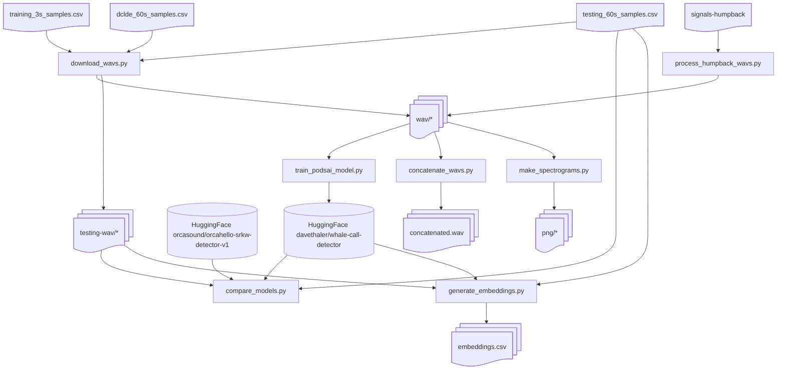

# Programmatic Orca Detection System using Artificial Intelligence (PODS-AI)

This repository contains scripts for training, evaluating, and using the
PODS-AI model for detecting orcas (both residents and Biggs/transients)
and humpbacks, based on [training data](docs/csv-manifests.md).

## Model Comparison

A comparison between the latest [PODS-AI model](https://huggingface.co/davethaler/whale-call-detector) and the current
[OrcaHello](https://github.com/orcasound/orcahello) model is:

```
================================================================================================================
Model Comparison Summary
================================================================================================================
Model           Evaluated   Correct  Accuracy      F1    RFP%    RFN%    TFP%    TFN%    HFP%    HFN%   Avg Time
----------------------------------------------------------------------------------------------------------------
orcahello             832       713     85.7%   0.262   16.3%    9.5%    0.0%  100.0%    0.0%  100.0%      4.06s
oldpodsai             832       242     29.1%   0.530    5.6%   23.0%    3.2%   25.0%    0.0%   87.5%      6.70s
podsai                832       267     32.1%   0.671    8.8%   16.9%    0.1%   35.7%    0.2%   68.8%      6.65s
================================================================================================================

Definitions:
  Accuracy     = Correct / Evaluated
  Correct      = fastai/orcahello: resident vs other; wav2vec2/oldpodsai/podsai: category in prediction set
  F1           = macro F1 over humpback, resident, and transient classes that are present
  [R|T|H]FP%   = among non-[R|T|H] samples, fraction predicted as that class
  [R|T|H]FN%   = among actual samples of that class, fraction predicted as another class
  Avg Time     = average time spent in model predict() per 60-second WAV file
  Note         = compares end-to-end 60-second inference on all WAV files in --wav-dir

Confusion Matrix for orcahello (rows=actual, cols=predicted):
                other  resident     total
    abiotic       486        10       496
       bird         1        10        11
      human         0         9         9
   humpback         5        11        16
     jingle         0        12        12
   resident        23       220       243
  transient         0        28        28
     vessel         0         6         6
      water         1        10        11

Confusion Matrix for oldpodsai (rows=actual, cols=predicted):
                  bird      human   humpback     jingle   resident  transient     vessel      water      total
    abiotic         15          0          0         42          1          0        420         18        496
       bird          1          0          0          0          6          0          4          0         11
      human          0          9          0          0          0          0          0          0          9
   humpback          0          0          1          1          3          1         10          0         16
     jingle          0          0          0          7          3          0          2          0         12
   resident          2          1          0          4        182          6         46          2        243
  transient          0          0          0          0         12         15          1          0         28
     vessel          0          0          0          0          0          0          6          0          6
      water          0          0          0          0          0          0         10          1         11

Confusion Matrix for podsai (rows=actual, cols=predicted):
                 human   humpback     jingle   resident  transient     vessel      water      total
    abiotic          0          1        242         13          0        220         20        496
       bird          0          0          1          9          0          1          0         11
      human          8          0          1          0          0          0          0          9
   humpback          0          4          6          3          0          2          1         16
     jingle          0          0         12          0          0          0          0         12
   resident          1          0         15        202          0         22          3        243
  transient          0          0          0         20          7          1          0         28
     vessel          0          0          0          0          0          6          0          6
      water          0          0          1          0          0          5          5         11
```

NOTE 1: The results above may be biased against models, compared to what would be expected on live
audio, since the testing set is weighted towards samples that were mispredicted in the past.

NOTE 2: The F1 score is lower than the F1 for individual 3-second periods on which the models
run.  This is because the prediction of a 60-second sample is based on multiple 3-second
periods, at least 2 of which must pass 60% confidence of a whale category before it will predict
that whale category.  Thus, if 2 out of 20 non-whale samples were mis-predicted as resident,
the F1 for the individual 3-second periods may be 90% but the 60-second sample would still
result in a false positive.

## Getting Started

1. Install Python 3.12

2. Install FFmpeg

Linux:
```
sudo apt-get install -y ffmpeg
```

Windows:
```
choco install ffmpeg -y
```

3. Install Python dependencies:

```
pip install -r requirements.txt
```

4. Patch fastai_audio

Linux:
```bash
patch_fastai_audio.sh
```

Windows:
```cmd
patch_fastai_audio.bat
```

5. Run unit tests with `python -m pytest tests/ -v -s`

If anything fails, compare what the [run_tests.yml](.github/workflows/run_tests.yml) workflow does.

See the [Contributing Guidelines](CONTRIBUTING.md) if you plan to contribute changes to this repository.

## Adding Testing Samples

To add new testing samples:

1. Use [process_false_negatives.py](docs/process-false-negatives.md) to find recent candidates reported
   by humans but missed by AI.
2. Use [process_false_positives.py](docs/process-false-positives.md) with `--set testing --end now` to find recent candidates
   by AI but marked as false positives by a moderator.
3. Use [run_inference.py](docs/run-inference.md) to see how the current PODS-AI performs on each
   segment, to see if it is a good test case.
4. Listen to the sample by navigating to the bouts URI, to verify it sounds reasonable.
5. Add the line to [testing_60s_samples.csv](docs/csv-manifests.md).
6. Run [download_wavs.py](docs/download-wavs.md) to verify there are no issues with the lines added,
   such as overlaps in time and location with other testing or training samples.

## Adding Training Samples

To add new training samples:

1. Use [process_testing_set_mispredictions.py](docs/process-testing-set-mispredictions.md) to find
   current testing set candidates to convert to training samples.
2. For any candidate:
   - Listen to the candidate 3-second samples by navigating to the bouts URI, to verify they sound reasonable.
   - Remove the row from [testing_60s_samples.csv](docs/csv-manifests.md)
   - Add rows to [training_3s_samples.csv](docs/csv-manifests.md).
3. For any rows removed from the testing set, [add more testing samples](#adding-testing-samples)
   so that the testing set does not shrink.

## Training a New Model

To have GitHub train a new model from the latest `main` branch:

1. Go to https://github.com/orcasound/pods-ai/actions/workflows/train_model.yml in a browser.
2. Open the "Run workflow" dropdown and click "Run workflow".  The process will take around 3 hours.
3. Add a tag to the main branch such as "model-20260905" if the date is Sept. 5, 2026.
4. Once the workflow completes, a new model will appear on [HuggingFace](https://huggingface.co/davethaler/whale-call-detector).
5. From HuggingFace, click the [Files](https://huggingface.co/davethaler/whale-call-detector/tree/main) tab.
6. Get the SHA hash of the latest commit, which will be a long string like `36620370fd59c8a70f9b7be6060d4f40717e796d`.    This can be found by clicking the short prefix to the right of "Model save", just above the list of files, and copying it from the path in the address bar.
7. Update the SHA commit to the latest version in `src/model_revisions.py`:
```
src/model_revisions.py:LATEST_PODSAI_MODEL_REVISION = "36620370fd59c8a70f9b7be6060d4f40717e796d"
```
The Docker image reads this same revision from that file.
8. Push the changes to a separate branch in the main repository.
9. Generate a model comparison as follows. Go to https://github.com/orcasound/pods-ai/actions/workflows/generate_model_comparison.yml in a browser, click the "Run workflow" dropdown, select the branch to use in "Use workflow from" and click "Run workflow". Results are committed to the selected branch, except that selecting `main` commits them to `update-model-comparison`. This may take several hours to run. You could instead run it locally using `python src/compare_models.py --models podsai` to verify that the F1 does not regress from the latest model as shown at the top of this README. Don't proceed further unless the F1 improves.
10. Update README.md with the latest model comparison results.
11. Generate a pull request with the changes
12. Once the pull request is merged, add another tag to the main branch such as
   `LiveInferenceSystem.v1.4.0` (bumping the version from the most recent such tag).
    This will cause the
    [LiveInferenceSystem-deploy.yaml](.github/workflows/LiveInferenceSystem-deploy.yaml)
    workflow to build a new container image and push it to the Azure Container Registry.
13. Once that succeeds, update the `LiveInferenceSystem/deploy/<slug>.yaml` files to
    reference the new image.  For example:
```
image: orcaconservancycr.azurecr.io/pods-ai-live-inference-system:09-05-2026.v1.4.0
```
14. Generate a pull request with those changes.
15. Once that pull request merges, apply the config, e.g., `kubectl apply -f deploy/andrews-bay.yaml` from the
    `LiveInferenceSystem` directory.  See [AzurePlaybook.md](https://github.com/orcasound/orcahello/blob/main/InferenceSystem/AzurePlaybook.md) for troubleshooting guidance if needed.

You can instead train a model locally:

1. Do `python src/process_humpback_wavs.py` to ensure that the humpback training samples are present.
2. Do `python src/download_wavs.py` to ensure that the training WAVs are up to date with the [CSV manifests](docs/csv-manifests.md).
3. Do `python src/train_podsai_model.py`
4. Run `python src/compare_models.py --models podsai` to evaluate the model using the testing set.

## Overview of Scripts

The active scripts in `src` include:

- **download_wavs.py**: Uses `output/csv/training_3s_samples.csv`, `output/csv/testing_60s_samples.csv`, and `output/csv/dclde_60s_samples.csv` to download wav files. It keeps `output/wav/humpback/signals-humpback_*.wav` segments from the `signals-humpback` submodule (those rows are not in the CSVs).
- **make_spectrograms.py**: Creates a png file for each wav file in a subdirectory of `output/png`.
- **train_podsai_model.py**: Trains a PODS-AI model on the generated training samples, including retained humpback signal windows.
- [**compare_models.py**](docs/compare-models.md): Evaluates models using `output/csv/testing_60s_samples.csv`.
- [**generate_embeddings.py**](docs/generate-embeddings.md): Generates `output/csv/embeddings.csv` from `output/csv/testing_60s_samples.csv`.
- [**concatenate_wavs.py**](docs/concatenate-wavs.md): Concatenates WAV files in a directory into a single output file,
  adding a short beep between clips to make quick listen-through review easier.
- [**process_false_positives.py**](docs/process-false-positives.md): Re-checks rejected OrcaHello detections by
  downloading the 60-second WAV, re-running PODS-AI, and appending whale-class
  sub-segments with corrected classes to `output/csv/new_manual_training_samples.csv`.
- [**process_false_negatives.py**](docs/process-false-negatives.md): Re-checks confirmed OrcaHello detections by
  downloading the 60-second WAV, re-running PODS-AI and OrcaHello segment inference,
  and appending segments where OrcaHello predicts resident but PODS-AI does not to
  `output/csv/new_manual_samples.csv` with corrected class `resident`.
- [**process_testing_set_mispredictions.py**](docs/process-testing-set-mispredictions.md): Scans `output/csv/testing_60s_samples.csv`,
  runs PODS-AI on each corresponding `output/testing-wav/<category>/...wav`, and
  proposes `training_3s_samples.csv` rows plus `testing_60s_samples.csv` rows to
  remove when non-adjacent high-confidence (>0.80) whale segments are found.
- [**run_inference.py**](docs/run-inference.md): Runs a model on a wav file and prints the global prediction,
  confidence, and per-class probabilities.
- [**generate_embeddings.py**](docs/generate-embeddings.md): Runs the PODS-AI AST model on a set of test WAV files and extracts the AST class token embeddings for each analyzed segment. Outputs a CSV containing embeddings, predictions, confidence scores, and metadata that can be used to generate UMAP visualizations of the model's learned audio representation.
- [**generate_umaps.py**](docs/generate-umaps.md): Creates a two-dimensional UMAP visualization from embeddings generated by `generate_embeddings.py`. Embeddings are projected using UMAP and colored by the selected label type (`ground_truth_label`, `predicted_label`, or `global_prediction_label`) to visualize how the PODS-AI AST model organizes different acoustic classes in embedding space. Outputs a publication-quality PNG figure.
- [**LiveInferenceOrchestrator.py**](docs/LiveInferenceOrchestrator.md): Runs live/date-range HLS inference with the multiclass
  PODS-AI model and can upload positive detections (resident/transient/humpback)
  to Azure Blob Storage and Cosmos DB.
- [**compare_models.py**](docs/compare-models.md): Evaluates and compares fastai, orcahello, podsai (AST), and oldpodsai (Wav2Vec2) models
  on the test set loaded from `output/csv/testing_60s_samples.csv` and downloaded by `download_wavs.py`).
  Reports correct identifications, false positives, false negatives, and average prediction time for each model.

Bootstrap-only generation scripts and archived CSV inputs now live under [`bootstrap/`](bootstrap/README.md).

## Data Flow Architecture


```mermaid
flowchart TD;
    podsaiModel[(HuggingFace davethaler/whale-call-detector)];
    orcaHelloModel[(HuggingFace orcasound/orcahello-srkw-detector-v1)];
    trainingSamples@{ shape: doc, label: "training_3s_samples.csv" };
    testingSamples@{ shape: doc, label: "testing_60s_samples.csv" };
    dcldeSamples@{ shape: doc, label: "dclde_60s_samples.csv" };
    signalsHumpback@{ shape: doc, label: "signals-humpback" };
    wav@{ shape: docs, label: "wav/*" };
    testingWav@{ shape: docs, label: "testing-wav/*" };
    concatenated@{ shape: docs, label: "concatenated.wav" };
    png@{ shape: docs, label: "png/*" };
    embeddings@{ shape: docs, label: "embeddings.csv" };

    downloadWavs@{ shape: rect, label: "download_wavs.py" };
    processHumpbackWavs@{ shape: rect, label: "process_humpback_wavs.py" };
    trainPodsaiModel@{ shape: rect, label: "train_podsai_model.py" };
    compareModels@{ shape: rect, label: "compare_models.py" };
    concatenateWavs@{ shape: rect, label: "concatenate_wavs.py" };
    makeSpectrograms@{ shape: rect, label: "make_spectrograms.py" };
    generateEmbeddings@{ shape: rect, label: "generate_embeddings.py" };

    trainingSamples-->downloadWavs-->wav;
    signalsHumpback-->processHumpbackWavs-->wav;
    dcldeSamples-->downloadWavs;
    testingSamples-->downloadWavs-->testingWav;

    wav-->trainPodsaiModel-->podsaiModel;

    podsaiModel-->compareModels;
    testingSamples-->compareModels;
    testingWav-->compareModels;
    orcaHelloModel-->compareModels;

    wav-->concatenateWavs-->concatenated;
    wav-->makeSpectrograms-->png;
    podsaiModel-->generateEmbeddings;
    testingSamples-->generateEmbeddings;
    testingWav-->generateEmbeddings-->embeddings;
```

## Dataset Manager (Windows)

`DatasetManager/` contains a Windows WPF application for reviewing and updating the training and testing datasets. It provides:

- Per-category counts for samples and downloaded WAVs, along with test accuracy and false-positive/false-negative statistics when `model-comparison.txt` is available.
- Training and testing sample grids with links to listen to the Orcasound audio, moderated tags, and on-demand PODS-AI inference.
- A review queue for proposed samples, with accept/reject actions and checks for overlaps with existing samples.
- Actions to find recent resident false negatives for training, testing false positives, and testing-set mispredictions by running the repository’s Python scripts.
- An option to refresh moderated tags and confidence values for testing samples from OrcaHello.

To build and run the app, use Windows with the .NET 10 SDK. Initialize the `external/orcahello` submodule, install the Python dependencies described in [Getting Started](#getting-started), and ensure `python` is available on `PATH`. From the repository root, run:

```powershell
dotnet run --project DatasetManager/DatasetManager.csproj
```

The app reads `output/csv/training_3s_samples.csv` and `output/csv/testing_60s_samples.csv`, and uses WAVs under `output/wav` and `output/testing-wav`. To run it against a repository checkout elsewhere, pass that checkout’s path after `--`. Use **Save** on the overview page to write accepted dataset changes back to the CSV files.
